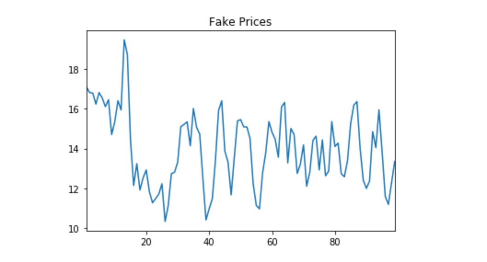

# # Financial-time-series-GAN-in-LibTorch

A GAN trained on a financial time-series of 'Close' prices for one stock (in this case, AAPL) using PyTorch's C++ API - LibTorch.

- `src/main.cpp` - Initializing/training and driver code
- `src/Networks.cpp` - Generator Discriminator networks
- `src/PriceDataset.cpp` - Dataset

Tested on LibTorch **1.5.0** without CUDA. OS was **macOS**, built in **XCode**.

Steps to run:
1. Build the entire project while including LibTorch in whichever way you please (ex. CMake)
2. Execute main.cpp
3. A csv will be created in the `src` directory with a fake price listed on each row.
4. Use any plotting software to view the plot.

# Results 

This is the output recorded after 200 epochs, simulating 100 days. 

# Notes

> This was by no means a quantitative approach but more of a qualitative approach. Hyperparameter-tuning and adding more features will definitely lead to a more accurate output. This was made to provide a example as to how LibTorch can be used for GANs. Kudos to the developers at PyTorch!

> This project wasn't tested on Windows/Linux but no reason as to why it shouldn't work. 
